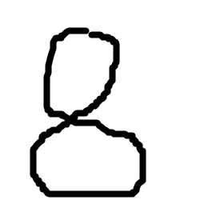

## 说明

	此为《人工智能入门实践》（肖波等著）6.2节代码，MNIST手写数字识别示例程序
	
	其中：
	
	(1) main_CNN.py是训练和测试简单的CNN模型
	    首次执行，会自动先下周MNIST数据集。
	  
	(2) main_mobileNetV2.py是使用mobileNetV2预训练模型进行训练和测试的代码（需要用到main_CNN.py中的部分模块）。
	
	(3) mnist_mobilenetV2_alone.py也是使用mobileNetV2预训练模型进行训练和测试的代码，是独立可以运行的。
	
	代码和前面的两个代码稍有不同。该代码实现了样本在进入模型前再变为3通道。
  
  
## 执行程序前，安装必要的包：

	pip install -r requirements.txt
 

## 如何识别真实图片中的文字？

    假设图片为a.png,如下：

### 对于main_CNN.py训练好的模型，如下代码可完成识别：

**************

注意，源代码中未加入模型持久化代码，例如：

torch.save(model, 'model.pth')

**************

from PIL import Image

import numpy as np

import torch

from main_CNN import CNN

img1 = Image.open('a.png').convert('L').resize((28, 28))

img2 = np.array(img1)

img2 = 1-img2/255

img2 = img2[np.newaxis, :]  # 扩展维度

img2 = img2[np.newaxis, :]  # 扩展维度

img2 = torch.tensor(img2, dtype=torch.float32)

model = torch.load('./model.pth', map_location=torch.device('cpu'))

model.eval()

y = model(img2)

index = torch.argmax(y, dim=1)

print(index)

### 对于mnist_mobilenetV2_alone.py训练好的模型，如下代码可完成识别：

**************

注意，mnist_mobilenetV2.py源代码中未加入模型持久化代码，读者可自行加入

**************

from PIL import Image

import numpy as np

import torch

from torchvision import transforms

from torchvision.models.mobilenet import mobilenet_v2

img1 = Image.open('a.png').convert('L').resize((28, 28))

img2 = np.array(img1)

img2 = 1-img2/255

img2 = torch.tensor(img2, dtype=torch.float32)

img2 = img2.repeat(1,3,1,1)

t = transforms.Normalize((0.1307,), (0.3081,))

img2 = t(img2) 

model = mobilenet_v2(pretrained=False)

model.classifier[1] = torch.nn.Linear(in_features=model.classifier[1].in_features, out_features=10)

model.load_state_dict( torch.load('./mnist_mobilenet.pt', map_location=torch.device('cpu')))

model.eval()

y = model(img2)

index = torch.argmax(y, dim=1)

print(index)

### 以上代码通常均输出：

[8]

表示识别结果为8，即识别正确。
